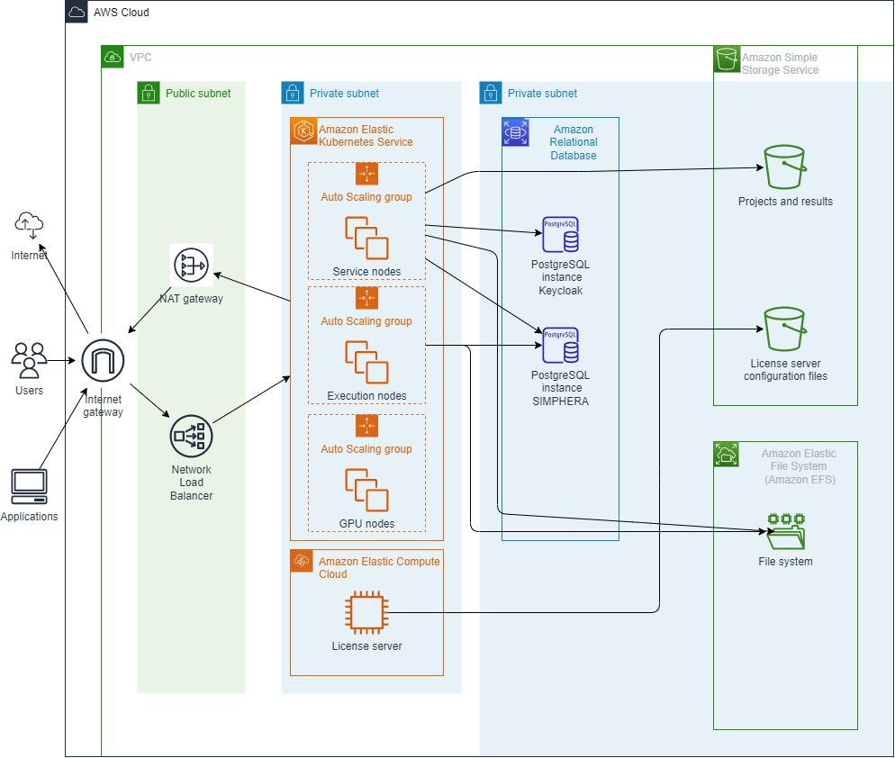

# SIMPHERA Reference Architecture for AWS

This repository contains the reference architecture of the infrastructure needed to deploy dSPACE SIMPHERA to AWS. It does not contain the helm chart needed to deploy SIMPHERA itself, but only the base infrastructure such as Kubernetes, PostgreSQL, storage accounts, etc.

You can use the reference architecture as a starting point for your SIMPHERA installation if you plan to deploy SIMPHERA to AWS. You can use the reference architecture as it is and only have to configure few individual values. If you have special requirements feel free to adapt the architecture to your needs. For example, the reference architecture does not contain any kind of VPN connection to a private, on-premise network because this is highly user specific. But the reference architecture is configured in such a way that the ingress points are available in the public internet.

Using the reference architecture you can deploy a single or even multiple instances of SIMPHERA, e.g. one for _production_ and one for _testing_.

## Architecture

The following figure shows the main resources of the architecture:

The main building brick of the SIMPHERA reference architecture for AWS is the Amazon EKS cluster.
The cluster contains two auto scaling groups:
The first group is reserved for SIMPHERA services and other auxiliary third-party services like Keycloak, nginx, etc.
The second group is for the executors that perform the testing of the system under test.
The data for SIMPHERA projects is stored in a Amazon RDS PostgreSQL instance.
Keycloak stores SIMPHERA users in a separate Amazon RDS PostgreSQL instance.
Executors need licenses to execute tests and simulations.
They obtain the licenses from a license server.
The license server is deployed on an EC2 instance.
Project files and test results are stored in an non-public Amazon S3 bucket.
For the initial setup of the license server, several files need to be exchanged between an administration PC and the license server.
These files are exchanged via an non-public S3 bucket that can be read and written from the administration PC and the license server.
A detailed list of the AWS resources that are mandatory/optional for the operation of SIMPHERA can be found in the [AWSCloudSpec](./AWSCloudSpec.md).

## Billable Resources and Services
Charges may apply for the following AWS resources and services:

| Service | Description | Mandatory? | 
| ------- | ----------- | ---------- | 
| Amazon Elastic Kubernetes Service | A Kubernetes cluster is required to run SIMPHERA. | Yes |
| Amazon Virtual Private Cloud | Virtual network for SIMPHERA. | Yes |
| Elastic Load Balancing | SIMPHERA uses a network load balancer. | Yes |
| Amazon EC2 Auto Scaling | SIMPHERA automatically scales compute nodes if the capacity is exhausted. | Yes |
| Amazon Relational Database | Project and authorization data is stored in Amazon RDS for PostgreSQL instances. | Yes |
| Amazon Simple Storage Service | Binary artifacts are stored in an S3 bucket. | Yes |
| AWS Key Management Service (AWS KMS) | Encryption for Kubernetes secrets is enabled by default. | |
| Amazon Elastic Compute Cloud | Optionally, you can deploy a dSPACE license server on an EC2 instance. Alternatively, you can deploy the server on external infrastructure. ||
| Amazon CloudWatch | Metrics and container logs to CloudWatch. It is recommended to deploy the dSPACE monitoring stack in Kubernetes.||

## Usage Instructions

To create the AWS resources that are required for operating SIMPHERA, you need to accomplish the following tasks:
1. install Terraform on your local administration PC
1. register an AWS account where the resources needed for SIMPHERA are created
1. create an IAM user with least privileges required to create the resources for SIMPHERA
1. create security credentials for that IAM user
1. create non-public S3 bucket for Terraform state
1. create IAM policy that gives the IAM user access to the S3 bucket
1. clone this repository onto your local administration PC
1. create Secrets manager secrets
1. adjust Terraform variables
1. apply Terraform configuration
1. connect to the Kubernetes cluster

### Install Terraform
This reference architecture is provided as a [Terraform](https://terraform.io/) configuration. Terraform is an open-source command line tool to automatically create and manage cloud resources. A Terraform configuration consists of various `.tf` text files. These files contain the specifications of the resources to be created in the cloud infrastructure. That is the reason why this approach is called _infrastructure-as-code_. The main advantage of this approach is _reproducibility_ because the configuration can be mainted in a source control system such as Git.

Terraform uses _variables_ to make the specification configurable. The concrete values for these variables are specified in `.tfvars` files. So it is the task of the administrator to fill the `.tfvars` files with the correct values. This is explained in more detail in a later chapter.

Terraform has the concept of a _state_. On the one hand side there are the resource specifications in the `.tf` files. On the other hand there are the resources in the cloud infrastructure that are created based on these files. Terraform needs to store _mapping information_ which element of the specification belongs to which resource in the cloud infrastructure. This mapping is called the _state_. In general you could store the state on your local hard drive. But that is not a good idea because in that case nobody else could change some settings and apply these changes. Therefore the state itself should be stored in the cloud.

This reference architecture has been tested with Terraform version v1.1.7.

### Create Security Credentials

You can create [security credentials](https://docs.aws.amazon.com/IAM/latest/UserGuide/id_credentials_access-keys.html#Using_CreateAccessKey) for that IAM user with the AWS console.
Terraform uses these security credentials to create AWS resources on your behalf.

On your administration PC you need to install the [Terraform](https://terraform.io/) command and the [AWS CLI](https://aws.amazon.com/cli/).
To [configure your aws account](https://docs.aws.amazon.com/cli/latest/userguide/cli-configure-quickstart.html) run the following command:
```bash
aws configure

AWS Access Key ID [None]: *********
AWS Secret Access Key [None]: *******
Default region name [None]: eu-central-1
Default output format [None]: json
```

### Create State Bucket

As mentioned before, Terraform stores the state of the resources it creates within an S3 bucket. 
The bucket name needs to be globally unique.

After you have created the bucket, you need to link it with Terraform:
To do so, please make a copy of the file `state-backend-template`, name it `state-backend.tf` and open the file in a text editor. The values have to point to an existing storage account to be used to store the Terraform state:

```hcl
terraform {
  backend "s3" {
    #The name of the bucket to be used to store the terraform state. You need to create this container manually.
    bucket = "terraform-state"

    #The name of the file to be used inside the container to be used for this terraform state.
    key    = "simphera.tfstate"
    
    #The region of the bucket.
    region = var.region
  }
}
```
Important: It is highly recommended to [enable server-side encryption of the state file](https://www.terraform.io/language/settings/backends/s3). Encryption is not enabled per default.
### Create IAM Policy for State Bucket
Create the following [IAM policy for accessing the Terraform state bucket](https://www.terraform.io/language/settings/backends/s3#s3-bucket-permissions) and assign it to the IAM user:

```json
{
    "Version": "2012-10-17",
    "Statement": [
        {
            "Effect": "Allow",
            "Action": "s3:ListBucket",
            "Resource": "arn:aws:s3:::terraform-state"
        },
        {
            "Effect": "Allow",
            "Action": [
                "s3:GetObject",
                "s3:PutObject"
            ],
            "Resource": "arn:aws:s3:::terraform-state/simphera.tfstate"
        }
    ]
}
```
### Create Secrets Manager Secrets

Username and password for the PostgreSQL databases are stored in AWS Secrets Manager.
Before you let Terraform create AWS resources, you need to manually create a Secrets Manager secret that stores the username and password.
It is recommended to create individual secrets per SIMPHERA instance (e.g. production and staging instance).
To create the secret, open the Secrets Manager console and click the button `Store a new secret`.
As secret type choose `Other type of secret`. 
The password must contain from 8 to 128 characters and must not contain any of the following: / (slash), '(single quote), "(double quote) and @ (at sign).
Open the Plaintext tab and paste the following JSON object and enter your usernames and passwords:
```json
{
  "postgresql_password": "<your password>"
}
```

Alternatively, you can create the secret with the following Powershell script:

```powershell
$region = "<your region>"
$postgresqlCredentials = @"
{
    "postgresql_password" : "<your password>"
}
"@ | ConvertFrom-Json | ConvertTo-Json -Compress
$postgresqlCredentials = $postgresqlCredentials -replace '([\\]*)"', '$1$1\"'
aws secretsmanager create-secret --name <secret name> --secret-string $postgresqlCredentials --region $region
```

On the next page you can define a name for the secret. 
Automatic credentials rotation is currently not supported by SIMPHERA, but you can <a href="#rotating-credentials">rotate secrets manually</a>.
You have to provide the name of the secret in your Terraform variables.
The next section describes how you need to adjust your Terraform variables.

### Adjust Terraform Variables

For your configuration, please make a copy of the file `terraform.tfvars.example`, name it `terraform.tfvars` and open the file in a text editor. This file contains all variables that are configurable including documentation of the variables. Please adapt the values before you deploy the resources.

```diff
simpheraInstances = {
  "production" = {
+    secretname = "<secret name>"
    }
}
```

### Apply Terraform Configuration

Before you can deploy the resources to AWS you have to initialize Terraform:

```sh
terraform init
```

Afterwards you can deploy the resources:

```sh
terraform apply
```
Terraform automatically loads the variables from your `terraform.tfvars` variable definition file.
Installation times may very, but it is expected to take up to 30 min to complete the deployment.

### Destroy Infrastructure

Resources that contain data, i.e. the databases, S3 storage, and the recovery points in the backup vault are protected against unintentional deletion.
:warning: **If you continue with the procedure described in this section, your data will be irretrievably deleted.** 


Before the backup vault can be deleted, all the continuous recovery points for S3 storage and the databases need to be deleted, for example by using the following Powershell snippet:
```powershell
$vaults = terraform output backup_vaults | ConvertFrom-Json
foreach ($vault in $vaults){
  Write-Host "Deleting $vault"
  $recoverypoints = aws backup list-recovery-points-by-backup-vault --backup-vault-name $vault | ConvertFrom-Json
  foreach ($rp in $recoverypoints.RecoveryPoints){
    aws backup delete-recovery-point --backup-vault-name $vault --recovery-point-arn $rp.RecoveryPointArn
  }
  foreach ($rp in $recoverypoints.RecoveryPoints){
    Do  
    {  
      Start-Sleep -Seconds 10
      aws backup describe-recovery-point --backup-vault-name $vault --recovery-point-arn $rp.RecoveryPointArn | ConvertFrom-Json
    } while( $LASTEXITCODE -eq 0)
  }  
  aws backup delete-backup-vault --backup-vault-name $vault
}
```


Before the databases can be deleted, you need to remove their delete protection:
```powershell
$databases = terraform output database_identifiers | ConvertFrom-Json
foreach ($db in $databases){
  Write-Host "Deleting database $db"
  aws rds modify-db-instance --db-instance-identifier $db --no-deletion-protection
  aws rds delete-db-instance --db-instance-identifier $db --skip-final-snapshot
}
```

You can remove the S3 buckets like this:
```powershell
$buckets = terraform output s3_buckets | ConvertFrom-Json
foreach ($bucket in $buckets){
  aws s3 rb s3://$bucket --force
}
```

The remaining infrastructure resources can be deleted via Terraform.
Due to a bug, Terraform is not able to properly [plan the removal of resources in the right order](https://github.com/aws-ia/terraform-aws-eks-blueprints/issues/353) which leads to a deadlock.
To workaround the bug, you need to need to remove the `eks-addons` module at first:

```sh
terraform destroy -target="module.eks-addons"
```

:warning: **It is important that you have completed the preceding steps. Otherwise, the following command will not finish completly, leaving you in a deadlock state.**

To delete the remaining resources, run the following command:
```sh
terraform destroy
```


### Connect to Kubernetes Cluster

This deployment contains a managed Kubernetes cluster (EKS). 
In order to use command line tools such as `kubectl` or `helm` you need a _kubeconfig_ configuration file. 
You can update your _kubeconfig_ using the [aws cli update-kubeconfig command](https://awscli.amazonaws.com/v2/documentation/api/latest/reference/eks/update-kubeconfig.html):


```bash
aws eks --region <region> update-kubeconfig --name <cluster_name> --kubeconfig <filename>
```

## Backup and Restore

SIMPHERA stores data in the PostgreSQL database and in S3 buckets (MinIO) that needs to be backed up.
AWS supports continuous backups for Amazon RDS for PostgreSQL and S3 that allows point-in-time recovery.
[Point-in-time recovery](https://docs.aws.amazon.com/aws-backup/latest/devguide/point-in-time-recovery.html) lets you restore your data to any point in time within a defined retention period.

This Terraform module creates an AWS backup plan that makes continuous backups of the PostgreSQL database and S3 buckets.
The backups are stored in an AWS backup vault per SIMPHERA instance.
An IAM role is also automatically created that has proper permissions to create backups.
To enable backups for your SIMPHERA instance, make sure you have the flag `enable_backup_service` et in your `.tfvars` file:

```hcl
simpheraInstances = {
  "production" = {
        enable_backup_service    = true
    }
}
```

### Amazon RDS for PostgreSQL

Create an target RDS instance (backup server) that is a copy of a source RDS instance (production server) of a specific point-in-time.
The command [`restore-db-instance-to-point-in-time`](https://awscli.amazonaws.com/v2/documentation/api/latest/reference/rds/restore-db-instance-to-point-in-time.html) creates the target database. 
Most of the configuration settings are copied from the source database.
To be able to connect to the target instance the easiest way is to explicitly set the same security group and subnet group as used for the source instance.

Restoring an RDS instance can be done via Powershell as described in the remainder:

```bash
aws rds restore-db-instance-to-point-in-time --source-db-instance-identifier simphera-reference-production-simphera --target-db-instance simphera-reference-production-simphera-backup --vpc-security-group-ids sg-0b954a0e25cd11b6d --db-subnet-group-name simphera-reference-vpc --restore-time 2022-06-16T23:45:00.000Z --tags Key=timestamp,Value=2022-06-16T23:45:00.000Z
```

Execute the following command to create the pgdump pod using the standard postgres image and open a bash:
```bash
kubectl run pgdump -ti -n simphera --image postgres --kubeconfig .\kube.config -- bash
```

In the pod's Bash, use the pg_dump and pg_restore commands to stream the data from the backup server to the production server:
```bash
pg_dump -h simphera-reference-production-simphera-backup.cexy8brfkmxk.eu-central-1.rds.amazonaws.com -p 5432 -U dbuser -Fc simpherareferenceproductionsimphera | pg_restore --clean --if-exists -h simphera-reference-production-simphera.cexy8brfkmxk.eu-central-1.rds.amazonaws.com -p 5432 -U dbuser -d simpherareferenceproductionsimphera
```

Alternatively, you can [restore the RDS instance via the AWS console](https://docs.aws.amazon.com/aws-backup/latest/devguide/restoring-rds.html).


### S3

This Terraform creates an S3 bucket for project data and results and enables versioning of the S3 bucket which is a requirement for point-in-time recovery.

To restore the S3 buckets to an older version you need to create an IAM role that has proper permissions:
```powershell
$rolename = "restore-role"
$trustrelation = @"
{
  "Version": "2012-10-17",
  "Statement": [
    {
      "Action": ["sts:AssumeRole"],
      "Effect": "allow",
      "Principal": {
        "Service": ["backup.amazonaws.com"]
      }
    }
  ]
}
"@

echo $trustrelation > trust.json

aws iam create-role --role-name $rolename --assume-role-policy-document file://trust.json --description "Role to restore"

aws iam attach-role-policy --role-name $rolename --policy-arn="arn:aws:iam::aws:policy/AWSBackupServiceRolePolicyForS3Restore"

aws iam attach-role-policy --role-name $rolename --policy-arn="arn:aws:iam::aws:policy/service-role/AWSBackupServiceRolePolicyForRestores"

$rolearn=aws iam get-role --role-name $rolename --query 'Role.Arn'
```

Restoring an S3 bucket can be done via Powershell as described in the remainder:
You can restore the S3 data in-place, into another existing bucket, or into a new bucket.

```powershell
$uuid = New-Guid
$metadata = @"
{
  "DestinationBucketName": "man-validation-platform-int-results",
  "NewBucket": "true",
  "RestoreTime": "2022-06-20T23:45:00.000Z",
  "Encrypted": "false",
  "CreationToken": "$uuid"
}
"@
$metadata = $metadata -replace '([\\]*)"', '$1$1\"'
aws backup start-restore-job `
--recovery-point-arn "arn:aws:backup:eu-central-1:012345678901:recovery-point:continuous:simphera-reference-production-0f51c39b" `
--iam-role-arn $rolearn `
--metadata $metadata
```

Alternatively, you can [restore the S3 data via the AWS console](https://docs.aws.amazon.com/aws-backup/latest/devguide/restoring-s3.html).


## Encryption

Encryption is enabled at all AWS resources that are created by Terraform:
 - PostgreSQL databases
 - S3 buckets
 - CloudWatch logs
 - Backup Vault

## Rotating Credentials

Credentials can be manually rotated:
Open the secret in the Secrets Manager console and change the passwords manually.
Fill in the placeholders `<namespace>` and the `<path_to_kubeconfig>` and run the following command to remove SIMPHERA from your Kubernetes cluster:

```bash
helm delete simphera -n <namespace> --kubeconfig <path_to_kubeconfig>
```

Reinstall the SIMPHERA Quickstart Helmchart so that all Kubernetes pods and jobs will retrieve the new credentials.
Important: During credentials rotation, SIMPHERA will not be available for a short period.

<!-- BEGIN_TF_DOCS -->
## Requirements

| Name | Version |
|------|---------|
| <a name="requirement_terraform"></a> [terraform](#requirement\_terraform) | >= 1.1.7 |
| <a name="requirement_aws"></a> [aws](#requirement\_aws) | >= 4.47 |
| <a name="requirement_helm"></a> [helm](#requirement\_helm) | 2.9.0 |
| <a name="requirement_kubernetes"></a> [kubernetes](#requirement\_kubernetes) | 2.18.1 |

## Providers

| Name | Version |
|------|---------|
| <a name="provider_aws"></a> [aws](#provider\_aws) | 4.59.0 |

## Modules

| Name | Source | Version |
|------|--------|---------|
| <a name="module_eks"></a> [eks](#module\_eks) | git::https://github.com/aws-ia/terraform-aws-eks-blueprints.git | v4.27.0 |
| <a name="module_eks-addons"></a> [eks-addons](#module\_eks-addons) | git::https://github.com/aws-ia/terraform-aws-eks-blueprints.git//modules/kubernetes-addons | v4.27.0 |
| <a name="module_security_group"></a> [security\_group](#module\_security\_group) | terraform-aws-modules/security-group/aws | ~> 4 |
| <a name="module_simphera_instance"></a> [simphera\_instance](#module\_simphera\_instance) | ./modules/simphera_aws_instance | n/a |
| <a name="module_vpc"></a> [vpc](#module\_vpc) | terraform-aws-modules/vpc/aws | v3.11.0 |

## Resources

| Name | Type |
|------|------|
| [aws_cloudwatch_log_group.flowlogs](https://registry.terraform.io/providers/hashicorp/aws/latest/docs/resources/cloudwatch_log_group) | resource |
| [aws_cloudwatch_log_group.ssm_install_log_group](https://registry.terraform.io/providers/hashicorp/aws/latest/docs/resources/cloudwatch_log_group) | resource |
| [aws_cloudwatch_log_group.ssm_scan_log_group](https://registry.terraform.io/providers/hashicorp/aws/latest/docs/resources/cloudwatch_log_group) | resource |
| [aws_flow_log.flowlog](https://registry.terraform.io/providers/hashicorp/aws/latest/docs/resources/flow_log) | resource |
| [aws_iam_instance_profile.license_server_profile](https://registry.terraform.io/providers/hashicorp/aws/latest/docs/resources/iam_instance_profile) | resource |
| [aws_iam_policy.flowlogs_policy](https://registry.terraform.io/providers/hashicorp/aws/latest/docs/resources/iam_policy) | resource |
| [aws_iam_policy.license_server_policy](https://registry.terraform.io/providers/hashicorp/aws/latest/docs/resources/iam_policy) | resource |
| [aws_iam_role.flowlogs_role](https://registry.terraform.io/providers/hashicorp/aws/latest/docs/resources/iam_role) | resource |
| [aws_iam_role.license_server_role](https://registry.terraform.io/providers/hashicorp/aws/latest/docs/resources/iam_role) | resource |
| [aws_iam_role_policy_attachment.flowlogs_attachment](https://registry.terraform.io/providers/hashicorp/aws/latest/docs/resources/iam_role_policy_attachment) | resource |
| [aws_iam_role_policy_attachment.license_server_ssm](https://registry.terraform.io/providers/hashicorp/aws/latest/docs/resources/iam_role_policy_attachment) | resource |
| [aws_iam_role_policy_attachment.minio_policy_attachment](https://registry.terraform.io/providers/hashicorp/aws/latest/docs/resources/iam_role_policy_attachment) | resource |
| [aws_instance.license_server](https://registry.terraform.io/providers/hashicorp/aws/latest/docs/resources/instance) | resource |
| [aws_kms_key.kms_key_cloudwatch_log_group](https://registry.terraform.io/providers/hashicorp/aws/latest/docs/resources/kms_key) | resource |
| [aws_s3_bucket.bucket_logs](https://registry.terraform.io/providers/hashicorp/aws/latest/docs/resources/s3_bucket) | resource |
| [aws_s3_bucket.license_server_bucket](https://registry.terraform.io/providers/hashicorp/aws/latest/docs/resources/s3_bucket) | resource |
| [aws_s3_bucket_acl.license_server_bucket_acl](https://registry.terraform.io/providers/hashicorp/aws/latest/docs/resources/s3_bucket_acl) | resource |
| [aws_s3_bucket_logging.logging](https://registry.terraform.io/providers/hashicorp/aws/latest/docs/resources/s3_bucket_logging) | resource |
| [aws_s3_bucket_policy.buckets_logs_ssl](https://registry.terraform.io/providers/hashicorp/aws/latest/docs/resources/s3_bucket_policy) | resource |
| [aws_s3_bucket_policy.license_server_bucket_ssl](https://registry.terraform.io/providers/hashicorp/aws/latest/docs/resources/s3_bucket_policy) | resource |
| [aws_s3_bucket_public_access_block.buckets_logs_access](https://registry.terraform.io/providers/hashicorp/aws/latest/docs/resources/s3_bucket_public_access_block) | resource |
| [aws_s3_bucket_server_side_encryption_configuration.bucket_logs_encryption](https://registry.terraform.io/providers/hashicorp/aws/latest/docs/resources/s3_bucket_server_side_encryption_configuration) | resource |
| [aws_ssm_maintenance_window.install](https://registry.terraform.io/providers/hashicorp/aws/latest/docs/resources/ssm_maintenance_window) | resource |
| [aws_ssm_maintenance_window.scan](https://registry.terraform.io/providers/hashicorp/aws/latest/docs/resources/ssm_maintenance_window) | resource |
| [aws_ssm_maintenance_window_target.install](https://registry.terraform.io/providers/hashicorp/aws/latest/docs/resources/ssm_maintenance_window_target) | resource |
| [aws_ssm_maintenance_window_target.scan](https://registry.terraform.io/providers/hashicorp/aws/latest/docs/resources/ssm_maintenance_window_target) | resource |
| [aws_ssm_maintenance_window_target.scan_eks_nodes](https://registry.terraform.io/providers/hashicorp/aws/latest/docs/resources/ssm_maintenance_window_target) | resource |
| [aws_ssm_maintenance_window_task.install](https://registry.terraform.io/providers/hashicorp/aws/latest/docs/resources/ssm_maintenance_window_task) | resource |
| [aws_ssm_maintenance_window_task.scan](https://registry.terraform.io/providers/hashicorp/aws/latest/docs/resources/ssm_maintenance_window_task) | resource |
| [aws_ssm_patch_baseline.production](https://registry.terraform.io/providers/hashicorp/aws/latest/docs/resources/ssm_patch_baseline) | resource |
| [aws_ssm_patch_group.patch_group](https://registry.terraform.io/providers/hashicorp/aws/latest/docs/resources/ssm_patch_group) | resource |
| [aws_ami.amazon_linux_kernel5](https://registry.terraform.io/providers/hashicorp/aws/latest/docs/data-sources/ami) | data source |
| [aws_availability_zones.available](https://registry.terraform.io/providers/hashicorp/aws/latest/docs/data-sources/availability_zones) | data source |
| [aws_eks_cluster.cluster](https://registry.terraform.io/providers/hashicorp/aws/latest/docs/data-sources/eks_cluster) | data source |
| [aws_eks_cluster_auth.cluster](https://registry.terraform.io/providers/hashicorp/aws/latest/docs/data-sources/eks_cluster_auth) | data source |
| [aws_region.current](https://registry.terraform.io/providers/hashicorp/aws/latest/docs/data-sources/region) | data source |

## Inputs

| Name | Description | Type | Default | Required |
|------|-------------|------|---------|:--------:|
| <a name="input_account_id"></a> [account\_id](#input\_account\_id) | The AWS account id to be used to create resources. | `string` | n/a | yes |
| <a name="input_cloudwatch_retention"></a> [cloudwatch\_retention](#input\_cloudwatch\_retention) | Global cloudwatch retention period for the EKS, VPC, SSM, and PostgreSQL logs. | `number` | `7` | no |
| <a name="input_enable_aws_for_fluentbit"></a> [enable\_aws\_for\_fluentbit](#input\_enable\_aws\_for\_fluentbit) | Install FluentBit to send container logs to CloudWatch. | `bool` | `false` | no |
| <a name="input_enable_ingress_nginx"></a> [enable\_ingress\_nginx](#input\_enable\_ingress\_nginx) | Enable Ingress Nginx add-on | `bool` | `false` | no |
| <a name="input_enable_patching"></a> [enable\_patching](#input\_enable\_patching) | Scans license server EC2 instance and EKS nodes for updates. Installs patches on license server automatically. EKS nodes need to be updated manually. | `bool` | `false` | no |
| <a name="input_infrastructurename"></a> [infrastructurename](#input\_infrastructurename) | The name of the infrastructure. e.g. simphera-infra | `string` | n/a | yes |
| <a name="input_install_schedule"></a> [install\_schedule](#input\_install\_schedule) | 6-field Cron expression describing the install maintenance schedule. Must not overlap with variable scan\_schedule. | `string` | `"cron(0 3 * * ? *)"` | no |
| <a name="input_kubernetesVersion"></a> [kubernetesVersion](#input\_kubernetesVersion) | The version of the EKS cluster. | `string` | `"1.22"` | no |
| <a name="input_licenseServer"></a> [licenseServer](#input\_licenseServer) | Specifies whether a license server VM will be created. | `bool` | `false` | no |
| <a name="input_linuxExecutionNodeCountMax"></a> [linuxExecutionNodeCountMax](#input\_linuxExecutionNodeCountMax) | The maximum number of Linux nodes for the job execution | `number` | `10` | no |
| <a name="input_linuxExecutionNodeCountMin"></a> [linuxExecutionNodeCountMin](#input\_linuxExecutionNodeCountMin) | The minimum number of Linux nodes for the job execution | `number` | `0` | no |
| <a name="input_linuxExecutionNodeSize"></a> [linuxExecutionNodeSize](#input\_linuxExecutionNodeSize) | The machine size of the Linux nodes for the job execution | `list(string)` | <pre>[<br>  "m5a.4xlarge",<br>  "m5a.8xlarge"<br>]</pre> | no |
| <a name="input_linuxNodeCountMax"></a> [linuxNodeCountMax](#input\_linuxNodeCountMax) | The maximum number of Linux nodes for the regular services | `number` | `12` | no |
| <a name="input_linuxNodeCountMin"></a> [linuxNodeCountMin](#input\_linuxNodeCountMin) | The minimum number of Linux nodes for the regular services | `number` | `1` | no |
| <a name="input_linuxNodeSize"></a> [linuxNodeSize](#input\_linuxNodeSize) | The machine size of the Linux nodes for the regular services | `list(string)` | <pre>[<br>  "m5a.4xlarge",<br>  "m5a.8xlarge"<br>]</pre> | no |
| <a name="input_maintainance_duration"></a> [maintainance\_duration](#input\_maintainance\_duration) | How long in hours for the maintenance window. | `number` | `3` | no |
| <a name="input_map_accounts"></a> [map\_accounts](#input\_map\_accounts) | Additional AWS account numbers to add to the aws-auth ConfigMap | `list(string)` | `[]` | no |
| <a name="input_map_roles"></a> [map\_roles](#input\_map\_roles) | Additional IAM roles to add to the aws-auth ConfigMap | <pre>list(object({<br>    rolearn  = string<br>    username = string<br>    groups   = list(string)<br>  }))</pre> | `[]` | no |
| <a name="input_map_users"></a> [map\_users](#input\_map\_users) | Additional IAM users to add to the aws-auth ConfigMap | <pre>list(object({<br>    userarn  = string<br>    username = string<br>    groups   = list(string)<br>  }))</pre> | `[]` | no |
| <a name="input_profile"></a> [profile](#input\_profile) | The AWS profile used. | `string` | `"default"` | no |
| <a name="input_region"></a> [region](#input\_region) | The AWS region to be used. | `string` | `"eu-central-1"` | no |
| <a name="input_scan_schedule"></a> [scan\_schedule](#input\_scan\_schedule) | 6-field Cron expression describing the scan maintenance schedule. Must not overlap with variable install\_schedule. | `string` | `"cron(0 0 * * ? *)"` | no |
| <a name="input_simpheraInstances"></a> [simpheraInstances](#input\_simpheraInstances) | A list containing the individual SIMPHERA instances, such as 'staging' and 'production'. | <pre>map(object({<br>    name                         = string<br>    postgresqlVersion            = string<br>    postgresqlStorage            = number<br>    postgresqlMaxStorage         = number<br>    db_instance_type_simphera    = string<br>    postgresqlStorageKeycloak    = number<br>    postgresqlMaxStorageKeycloak = number<br>    db_instance_type_keycloak    = string<br>    k8s_namespace                = string<br>    secretname                   = string<br>    enable_backup_service        = bool<br>    backup_retention             = number<br>    enable_deletion_protection   = bool<br><br>  }))</pre> | n/a | yes |
| <a name="input_tags"></a> [tags](#input\_tags) | The tags to be added to all resources. | `map(any)` | `{}` | no |
| <a name="input_vpcCidr"></a> [vpcCidr](#input\_vpcCidr) | The CIDR for the virtual private cluster. | `string` | `"10.1.0.0/18"` | no |
| <a name="input_vpcDatabaseSubnets"></a> [vpcDatabaseSubnets](#input\_vpcDatabaseSubnets) | List of CIDRs for the database subnets. | `list(any)` | <pre>[<br>  "10.1.24.0/22",<br>  "10.1.28.0/22",<br>  "10.1.32.0/22"<br>]</pre> | no |
| <a name="input_vpcPrivateSubnets"></a> [vpcPrivateSubnets](#input\_vpcPrivateSubnets) | List of CIDRs for the private subnets. | `list(any)` | <pre>[<br>  "10.1.0.0/22",<br>  "10.1.4.0/22",<br>  "10.1.8.0/22"<br>]</pre> | no |
| <a name="input_vpcPublicSubnets"></a> [vpcPublicSubnets](#input\_vpcPublicSubnets) | List of CIDRs for the public subnets. | `list(any)` | <pre>[<br>  "10.1.12.0/22",<br>  "10.1.16.0/22",<br>  "10.1.20.0/22"<br>]</pre> | no |

## Outputs

| Name | Description |
|------|-------------|
| <a name="output_backup_vaults"></a> [backup\_vaults](#output\_backup\_vaults) | Backups vaults from all SIMPHERA instances. |
| <a name="output_database_identifiers"></a> [database\_identifiers](#output\_database\_identifiers) | Identifiers of the SIMPHERA and Keycloak databases from all SIMPHERA instances. |
| <a name="output_s3_buckets"></a> [s3\_buckets](#output\_s3\_buckets) | S3 buckets from all SIMPHERA instances. |
<!-- END_TF_DOCS -->